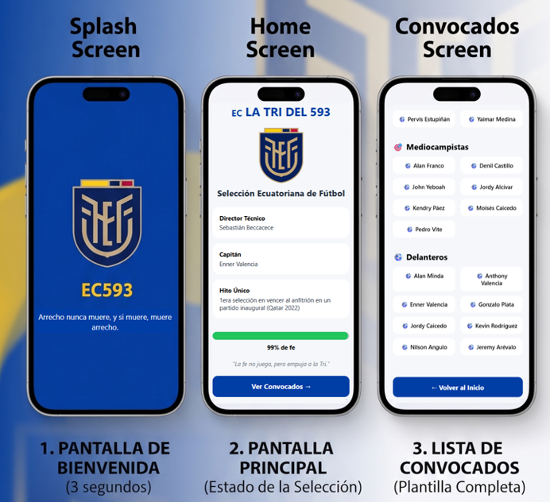

# 🇪🇨 EC593 Fútbol App

Aplicación móvil desarrollada con **React Native**, **Expo Router** y **Expo SDK 54**, que presenta información básica de la Selección Ecuatoriana de Fútbol.

El proyecto fue desarrollado con fines académicos para familiarizarse con el desarrollo de aplicaciones móviles multiplataforma, la estructura de proyectos Expo y los componentes fundamentales de React Native.

<p align="center">
  
</p>

---


## 📱 Características

- Pantalla de bienvenida (Splash Screen).
- Logo de la Selección Ecuatoriana de Fútbol.
- Frase representativa ecuatoriana.
- Pantalla principal con información del equipo.
- Indicador visual de confianza rumbo al Mundial 2026.
- Pantalla de convocados organizada por posiciones.
- Navegación entre pantallas mediante Expo Router.
- Diseño adaptable para dispositivos móviles Android.

---

## 🛠️ Tecnologías Utilizadas

- React Native
- Expo SDK 54
- Expo Router
- TypeScript
- Expo Go

---

## ⚠️ Compatibilidad

Este proyecto fue desarrollado utilizando **Expo SDK 54** para garantizar compatibilidad con la versión de Expo Go utilizada durante el desarrollo y las pruebas.

Se recomienda utilizar una versión de Expo Go compatible con SDK 54.

---

## 📋 Requisitos Previos

Antes de ejecutar la aplicación es necesario contar con:

### Node.js

Verificar la instalación:

```bash
node --version
npm --version
```

Se recomienda utilizar una versión LTS de Node.js.

Descarga:

https://nodejs.org

---

### Expo Go

Instalar la aplicación **Expo Go** en el dispositivo móvil Android desde Google Play Store.

Buscar:

```text
Expo Go
```

---

## 📂 Estructura del Proyecto

```text
ec593-futbol-app/
│
├── app/
│   ├── _layout.tsx
│   ├── index.tsx
│   └── convocados.tsx
│
├── assets/
│   └── images/
│
├── components/
│   ├── Header.tsx
│   ├── InfoCard.tsx
│   ├── PlayerCard.tsx
│   ├── PlayerSection.tsx
│   └── ProgressBar.tsx
│
├── constants/
│   ├── colors.ts
│   ├── players.ts
│   └── texts.ts
│
├── hooks/
│   └── useSplashTimer.ts
│
├── types/
│   ├── index.ts
│   └── team.ts
│
├── package.json
└── README.md
```

---

## 🚀 Instalación

### 1. Clonar el repositorio

```bash
git clone https://github.com/RAlexis14/ec593-futbol-app.git
```

### 2. Ingresar al proyecto

```bash
cd ec593-futbol-app
```

### 3. Instalar dependencias

```bash
npm install
```

### 4. Verificar Expo

```bash
npx expo --version
```

### 5. Ejecutar la aplicación

```bash
npx expo start
```

---

## 📲 Ejecución en Dispositivo Móvil

Una vez iniciado el proyecto:

1. Abrir Expo Go en el teléfono móvil.
2. Escanear el código QR generado por Expo.
3. Esperar la carga inicial de la aplicación.
4. La aplicación se ejecutará automáticamente.

---

## 🎨 Pantallas Implementadas

### Splash Screen

Incluye:

- Logo de la Selección Ecuatoriana.
- Identificador EC593.
- Frase representativa del Ecuador.
- Duración automática de 3 segundos antes de navegar a la pantalla principal.

### Home Screen

Presenta información básica de la selección:

- Director Técnico.
- Capitán.
- Hito Mundialista
- Indicador visual de confianza.
- Botón interactivo para consultar la lista de convocados.

### Pantalla de Convocados

Muestra la lista de jugadores organizada por:

- Porteros.
- Defensas.
- Mediocampistas.
- Delanteros.

---

## 🏗️ Arquitectura del Proyecto

El proyecto utiliza una arquitectura modular basada en componentes reutilizables.

### Componentes

- Header
- InfoCard
- ProgressBar
- PlayerCard
- PlayerSection

### Organización

- Componentes reutilizables.
- Separación de constantes.
- Hooks personalizados.
- Tipado mediante TypeScript.
- Navegación mediante Expo Router.

---

## 🎯 Objetivos Académicos

Este proyecto permitió aplicar conocimientos relacionados con:

- Instalación y configuración de React Native.
- Uso de Expo Go.
- Desarrollo móvil multiplataforma.
- Navegación entre pantallas.
- Creación de componentes reutilizables.
- Buenas prácticas de programación.
- Organización modular del código.

---

## ⚠️ Solución de Problemas Comunes

### Error: Cannot find module

Ejecutar nuevamente:

```bash
npm install
```

---

### Error al iniciar Expo

Limpiar la caché:

```bash
npx expo start --clear
```

---

### El teléfono no detecta el proyecto

Verificar que:

- El teléfono y la computadora estén conectados a la misma red Wi-Fi.
- Expo Go tenga permisos de red.
- El código QR se encuentre visible y actualizado.

---

## 👨‍💻 Autor

**Rommel Pachacama**

Universidad Central del Ecuador

2026

---

## 📄 Licencia

Proyecto desarrollado con fines exclusivamente educativos y académicos.